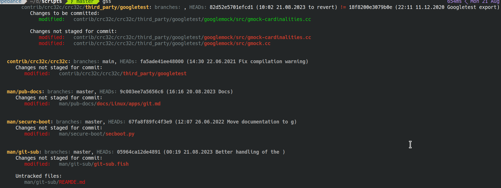

## **Problem**

It would look silly if `git status` required you to `cd` to every directory of your repo to list files changed
in this directory (and only this directory!).

Unfortunately, this is exactly what happens when you have (nested) submodules:

```
git status
On branch master
Your branch is up-to-date with 'origin/master'.

Changes not staged for commit:
  (use "git add <file>..." to update what will be committed)
  (use "git restore <file>..." to discard changes in working directory)
  (commit or discard the untracked or modified content in submodules)
        modified:   man/git-sub (modified content, untracked content)
        modified:   man/pub-docs (modified content)
        modified:   man/secure-boot (modified content)

```

what "content" has been "modified" in `man/git-sub`?

This happens to all the other command (apart from git push, which has `push.recurseSubmodules on-demand`).

* You cannot add files: `fatal: Pathspec 'man/git-sub/git-sub.fish' is in submodule 'man/git-sub'`
* You cannot commit files, and expect that parent repo will automatically track the files (you need to
  add+commit submodule in the parent repo, and then repeat this for all parent repos). This is in contrast
  to usual commit: you can commit arbitrary nested file in a single `git commit`.


## **Solution**

The file in the repo has a set of helpers.


For example, this is the output of `impl_git::status_for_each_submodule`:




```
gss
          contrib/crc32c/crc32c/third_party/googletest: branches: , HEADs: 82d52e5701efcd1 (10:02 21.08.2023 to revert) != 18f8200e3079b0e (22:11 11.12.2020 Googletest export)
             Changes to be committed:
                modified:   contrib/crc32c/crc32c/third_party/googletest/googlemock/src/gmock-cardinalities.cc

             Changes not staged for commit:
                modified:   contrib/crc32c/crc32c/third_party/googletest/googlemock/src/gmock-cardinalities.cc
                modified:   contrib/crc32c/crc32c/third_party/googletest/googlemock/src/gmock.cc


     contrib/crc32c/crc32c: branches: main, HEADs: fa5ade41ee48000 (14:30 22.06.2021 Fix compilation warning)
        Changes not staged for commit:
           modified:   contrib/crc32c/crc32c/third_party/googletest


     man/pub-docs: branches: master, HEADs: 9c003ee7a5656c6 (16:16 20.08.2023 Docs)
        Changes not staged for commit:
           modified:   man/pub-docs/docs/Linux/apps/git.md


     man/git-sub: branches: master, HEADs: 05964ca12de4891 (00:19 21.08.2023 Better handling of the )
        Changes not staged for commit:
           modified:   man/git-sub/git-sub.fish

        Untracked files:
           man/git-sub/REAMDE.md
```

For example

* from this part:

    ```
    HEADs: 82d52e5701efcd1 (10:02 21.08.2023 to revert) != 18f8200e3079b0e (22:11 11.12.2020 Googletest export)
    ```

    we know that `contrib/crc32c/crc32c/third_party/googletest` has a commit
    `82d52e5701efcd1 (10:02 21.08.2023 to revert)` that is new / unknown to its parent repo. The commit that is
    expected by the parent repo is `18f8200e3079b0e (22:11 11.12.2020 Googletest export)`

* from this part:

    ```
    man/git-sub: branches: master, HEADs: 05964ca12de4891 (00:19 21.08.2023 Better handling of the )
       Changes not staged for commit:
          modified:   man/git-sub/git-sub.fish
    ```

    we know that actual branch and expected by the parent repo is `master`, but the submodule has modified file.


Below are other useful helpers:

```fish
# ============================================================================================================
# git submodules shortcuts:

function gss # git submodule status
   impl_git::status_for_each_submodule $argv
end

function gsa # git submodule add
   # Description:
   # Unlike vanilla git add, it accepts full path (even if there are submodules), cd's to appropriate submodule
   # and invokes git add

   impl_git::add_files $argv
end

function gscm # git submodule commit
   # Description:
   # Goes from leafs to root and for each submodule, adds its submodules that have new commits, and then
   # commits (whatever is in staging area: can be only the submodule and can only be new files or can be both)

   impl_git::git_commit $argv
end

function gsr # git submodule restore
   # Description:
   # Takes any path of a file, finds its submodule, and calls git restore ... (and then returns to prev dir)

   impl_git::git_restore $argv
end

function gs-diff # git submodule diff
   # Description:
   # Takes any path (presumably submodule's), cd's into it, and calls git diff (and then returns to prev dir)

   impl_git::git_diff $argv
end

function gs-log # git submodule log
   # Description:
   # Takes any path (presumably submodule's), cd's into it, and calls git log (and then returns to prev dir)

   impl_git::git_log $argv
end

function gs-pull # git submodule pull
   # Description:
   # Takes an optional list of **submodule** paths. If the list is empty, uses the root repo and performs
   # "git pull && git submodule sync --recursive && git submodule update --init --recursive"

   impl_git::git_pull $argv
end

function gs-branch
   # Description:
   # Gets rid of "Detached HEAD" state where possible.
   # Takes an optional list of **submodule** paths. If the list is empty, uses the root repo and
   # checks out the branch that is recorded in .gitmodules (this is what was used when you added submodule via:
   # git submodule add -b master ...asdf.git ./asdf)

   impl_git::checkout_branches $argv
end

function gs-print # git submodule print
   impl_git::print_submodules
end

function gs-impose-parents
   # Description:
   # Makes state of submodules consistent with what is expected by parents.
   # -f will use "git reset hard" before checking out parents state, so it is higly destructive
   # -p will also fetch (potentially updated) URLs of submodules from upstream
   # -d force dry-run
   # the rest is interpreted as a list of paths of **submodules** to "fix"

   impl_git::impose_parents_will $argv
end
```
